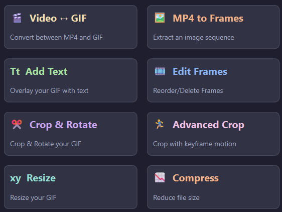
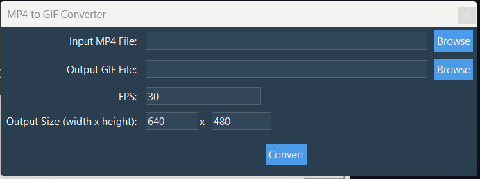
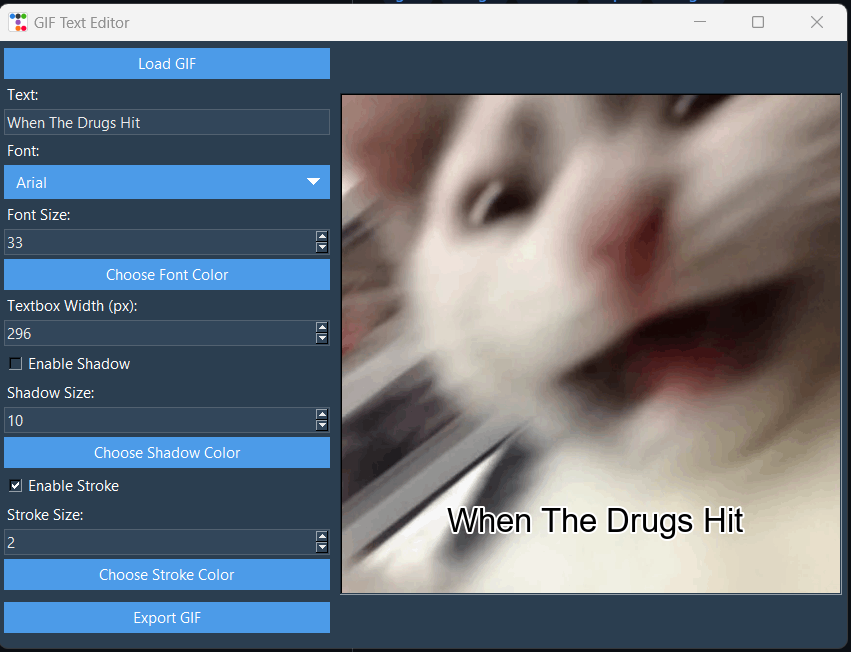
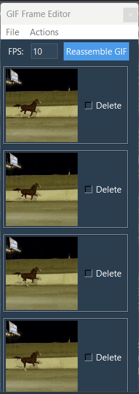
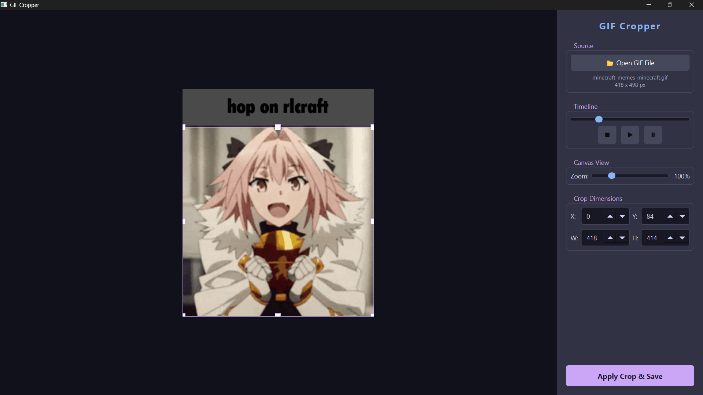
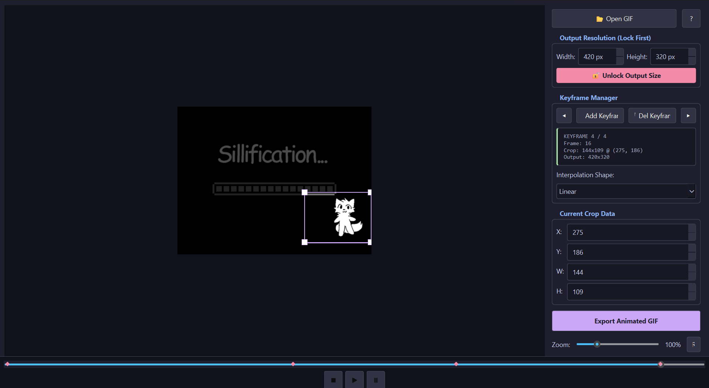
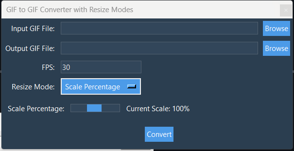
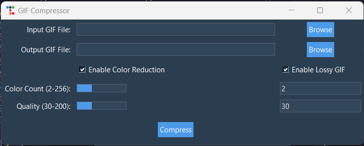

<h1 align="center">GifTools</h1>
<p align="center">
GifTools is a suite of lightweight tools for editing GIFs. Whether you need to convert an MP4 video into a GIF or resize an existing GIF, GifTools has you covered!
</p>



## Tools
| Tool                | Description                         | Demo                                           |
|---------------------|-------------------------------------|------------------------------------------------|
| Convert MP4 to GIF  | Convert MP4 videos to GIFs          |      |
| Add Text to GIF     | Overlay text on GIFs                |      |
| Edit GIF Frames     | Add, remove, rearrange, and export frame(s) in GIFs           |  |
| Quick Crop     | Quickly crops your GIFs           |  |
| Advanced Crop     | Quickly crops your GIFs, now with keyframes support           |  |
| Resize GIF          | Change GIF dimensions               |            |
| Compress GIF        | Reduce GIF file size                |        |

## Installation

Use [pip](https://pip.pypa.io/en/stable/) to install requirements.txt

```bash
  pip install -r requirements.txt
```

Or you can download the [executable](https://github.com/TheXploler/GifTools/releases/latest)

> [!IMPORTANT]
> On **Windows**, you may see a warning message indicating that the app is from an unknown publisher. Click **More info** and then **Run anyway** to proceed.

## Run

```bash
python "GifTools.py"
```

## Contributing

All contributions are welcome!

If you face any issues or have a recommendation for a feature, don't hesitate to open a new issue, Thanks 😊

- Fandrest (TheXploler)
## License

[GNU GPLv3](https://choosealicense.com/licenses/gpl-3.0/)
